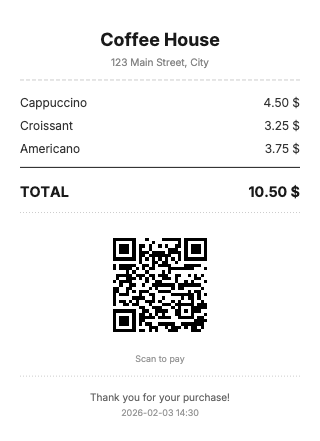
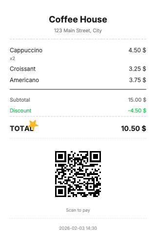
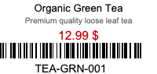
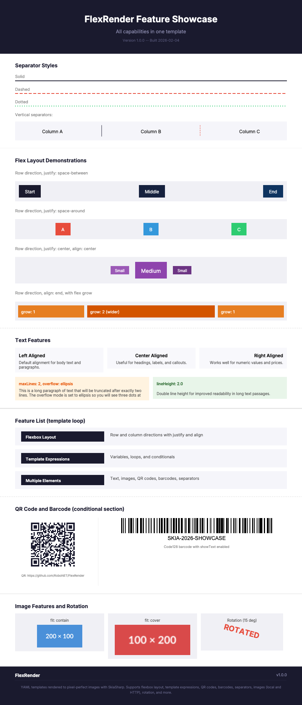

# FlexRender

[](https://www.nuget.org/packages/FlexRender)
[](https://www.nuget.org/packages/FlexRender)
[](https://github.com/RoboNET/FlexRender/actions/workflows/ci.yml)
[](https://opensource.org/licenses/MIT)

A .NET library for rendering images from YAML templates with flexbox-like layout system. Perfect for generating receipts, labels, tickets, and other structured documents.

## For LLM Agents

This project includes optimized documentation for AI coding assistants:

- [`llms.txt`](llms.txt) - Concise project overview (~200 lines)
- [`llms-full.txt`](llms-full.txt) - Comprehensive reference with all YAML properties, API details, and conventions (~600 lines)
- [`AGENTS.md`](AGENTS.md) - Build commands, coding conventions, and contributor guidelines

## Features

- **YAML Templates** - Define layouts in readable YAML format
- **Flexbox Layout** - Row/column direction, wrap, justify, align, gap
- **Template Engine** - Variables, loops (`type: each`), conditionals (`type: if`)
- **Multiple Content Types** - Text, images, QR codes, barcodes
- **Output Formats** - PNG, JPEG, BMP, Raw
- **CLI Tool** - Render templates from command line
- **AOT Compatible** - No reflection, works with Native AOT
- **Modular Architecture** - Install only what you need

## Examples

| Receipt | Dynamic Receipt | Ticket | Label |
|---------|-----------------|--------|-------|
|  |  |  |  |

<details>
<summary>Feature Showcase (click to expand)</summary>



</details>

All examples are in the [`examples/`](examples/) directory. Render them with the CLI:

```bash
flexrender render examples/receipt.yaml -d examples/receipt-data.json -o examples/output/receipt.png
flexrender render examples/ticket.yaml -d examples/ticket-data.json -o examples/output/ticket.png
flexrender render examples/receipt-dynamic.yaml -d examples/receipt-dynamic-data.json -o examples/output/receipt-dynamic.png

# Watch mode - auto re-render on file changes
flexrender watch examples/receipt.yaml -d examples/receipt-data.json -o preview.png
```

The `receipt-dynamic.yaml` demonstrates AST-level control flow with `type: each` for item lists and `type: if` for conditional sections.

## Installation

### All-in-one (recommended)

```bash
dotnet add package FlexRender
```

> [!IMPORTANT]
> **Linux / Docker users:** SkiaSharp requires native libraries. Add the native assets package to avoid `DllNotFoundException: libSkiaSharp`:
> ```bash
> dotnet add package SkiaSharp.NativeAssets.Linux
> # For minimal containers without fontconfig/freetype:
> dotnet add package SkiaSharp.NativeAssets.Linux.NoDependencies
> ```

### Individual packages

| Package | Description |
|---------|-------------|
| `FlexRender.Core` | Layout engine, 0 external dependencies |
| `FlexRender.Yaml` | YAML template parser |
| `FlexRender.Skia` | SkiaSharp renderer |
| `FlexRender.QrCode` | QR code support |
| `FlexRender.Barcode` | Barcode support |
| `FlexRender.Http` | HTTP/HTTPS resource loading |
| `FlexRender.DependencyInjection` | Microsoft DI integration |

```bash
# Example: install only the core engine and YAML parser
dotnet add package FlexRender.Core
dotnet add package FlexRender.Yaml

# Or install the Skia renderer
dotnet add package FlexRender.Skia
```

### CLI tool

```bash
dotnet tool install -g flexrender-cli
```

## Quick Start

### 1. Create a template (receipt.yaml)

```yaml
template:
  name: "receipt"
  version: 1

canvas:
  fixed: width
  width: 300
  background: "#ffffff"

layout:
  - type: flex
    padding: 20
    gap: 10
    children:
      - type: text
        content: "{{shopName}}"
        font: bold
        size: 1.5em
        align: center

      - type: flex
        gap: 4
        children:
          - type: each
            array: items
            as: item
            children:
              - type: flex
                direction: row
                justify: space-between
                children:
                  - type: text
                    content: "{{item.name}}"
                  - type: text
                    content: "{{item.price}} $"

      - type: text
        content: "Total: {{total}} $"
        font: bold
        size: 1.2em
        align: right

      - type: qr
        data: "{{paymentUrl}}"
        size: 100
```

### 2. Render with code

```csharp
// Build renderer with fluent API
var render = new FlexRenderBuilder()
    .WithBasePath("./templates")
    .WithSkia(skia => skia
        .WithQr()
        .WithBarcode())
    .Build();

var data = new ObjectValue
{
    ["shopName"] = "My Shop",
    ["total"] = 1500,
    ["paymentUrl"] = "https://pay.example.com/123",
    ["items"] = new ArrayValue(
        new ObjectValue { ["name"] = "Product 1", ["price"] = 500 },
        new ObjectValue { ["name"] = "Product 2", ["price"] = 1000 })
};

// Render to PNG bytes
byte[] pngBytes = await render.RenderFile("receipt.yaml", data);
await File.WriteAllBytesAsync("receipt.png", pngBytes);
```

### 3. With Dependency Injection

```csharp
// Program.cs
services.AddFlexRender(builder => builder
    .WithBasePath("/app/templates")
    .WithSkia(skia => skia
        .WithQr()
        .WithBarcode()));

// In your service
public class ReceiptService(IFlexRender render)
{
    public async Task<byte[]> Generate(ReceiptData data)
    {
        var values = MapToObjectValue(data);
        return await render.RenderFile("receipt.yaml", values);
    }
}
```

### 4. Or use CLI

```bash
flexrender render receipt.yaml -d data.json -o receipt.png
```

## Output Formats

| Format | Extension | Description |
|--------|-----------|-------------|
| PNG | `.png` | Lossless compression, best quality |
| JPEG | `.jpg` | Lossy compression, smaller file size |
| BMP | `.bmp` | Uncompressed bitmap |
| Raw | `.raw` | Raw BGRA pixel data (4 bytes per pixel) |

The Raw format outputs uncompressed pixel data in BGRA order (Blue, Green, Red, Alpha), 4 bytes per pixel, row by row from top to bottom. Useful for direct hardware integration or custom processing pipelines.

## Template Syntax

### Canvas Settings

```yaml
canvas:
  fixed: width          # or height - which dimension is fixed
  size: 300             # size in pixels
  background: "#ffffff" # background color
```

### Text Element

```yaml
- type: text
  content: "Hello {{name}}!"
  font: main            # font reference
  size: 1.2em           # pixels, em, or percentage
  color: "#000000"
  align: center         # left/center/right
  wrap: true
  overflow: ellipsis    # ellipsis/clip/visible
  maxLines: 2
  rotate: none          # none/left/right/flip or degrees
```

### Flex Container

```yaml
- type: flex
  direction: row        # row/column
  wrap: wrap            # nowrap/wrap/wrap-reverse
  gap: 10
  padding: 5%
  justify: space-between  # start/center/end/space-between/space-around/space-evenly
  align: center           # start/center/end/stretch/baseline
  children:
    - type: text
      content: "Item"
      flex:
        grow: 1
        shrink: 0
        basis: auto
```

### QR Code

```yaml
- type: qr
  data: "{{url}}"
  size: 100
  errorCorrection: M    # L/M/Q/H
  foreground: "#000000"
  background: "#ffffff"
```

### Barcode

```yaml
- type: barcode
  data: "{{ean13}}"
  format: ean13         # ean13/ean8/code128/code39/upc
  width: 200
  height: 80
  showText: true
  foreground: "#000000"
  background: "#ffffff"
```

### Image

```yaml
- type: image
  src: "logo.png"       # or base64 from data
  width: 80%
  height: auto
  fit: contain          # contain/cover/fill/none
```

## Template Expressions

### Variable Substitution

```yaml
# Simple variable
content: "Hello {{name}}"

# Nested access
content: "City: {{user.address.city}}"

# Array index
content: "First: {{items[0].name}}"
```

### Loops (type: each)

```yaml
# Iterate over array
- type: each
  array: items          # path to array in data
  as: item              # variable name for current item
  children:
    - type: text
      content: "{{item.name}}: {{item.price}}"

# Loop variables: @index, @first, @last
- type: each
  array: items
  as: item
  children:
    - type: text
      content: "{{@index}}. {{item.name}}"
```

### Conditionals (type: if)

The `if` element supports 12 comparison operators:

| Operator | YAML Key | Description |
|----------|----------|-------------|
| Truthy | (none) | Value exists and is not empty/zero/false |
| Equals | `equals` | Value equals (strings, numbers, bool, arrays, null) |
| NotEquals | `notEquals` | Value does not equal |
| In | `in` | Value is in the list |
| NotIn | `notIn` | Value is not in the list |
| Contains | `contains` | Array contains element |
| GreaterThan | `greaterThan` | Number is greater |
| GreaterThanOrEqual | `greaterThanOrEqual` | Number >= |
| LessThan | `lessThan` | Number is less |
| LessThanOrEqual | `lessThanOrEqual` | Number <= |
| HasItems | `hasItems` | Array is not empty (true) or empty (false) |
| CountEquals | `countEquals` | Array length equals N |
| CountGreaterThan | `countGreaterThan` | Array length > N |

```yaml
# Truthy check
- type: if
  condition: discount
  then:
    - type: text
      content: "Discount: {{discount}}%"

# Equality (works with numbers, strings, bool, null)
- type: if
  condition: status
  equals: "paid"
  then:
    - type: text
      content: "Payment received"

# In list
- type: if
  condition: role
  in: ["admin", "moderator"]
  then:
    - type: text
      content: "Staff member"

# Numeric comparison
- type: if
  condition: total
  greaterThan: 1000
  then:
    - type: text
      content: "Free shipping!"

# Array has items
- type: if
  condition: items
  hasItems: true
  then:
    - type: each
      array: items
      children:
        - type: text
          content: "{{item.name}}"

# Array count
- type: if
  condition: items
  countGreaterThan: 5
  then:
    - type: text
      content: "Bulk order discount applied"

# Else-if chain
- type: if
  condition: status
  equals: "paid"
  then:
    - type: text
      content: "PAID"
      color: "#22c55e"
  elseIf:
    condition: status
    equals: "pending"
    then:
      - type: qr
        data: "{{paymentUrl}}"
        size: 100
  else:
    - type: text
      content: "Payment required"
      color: "#ef4444"
```

## CLI Commands

```bash
# Render template
flexrender render template.yaml -d data.json -o output.png
flexrender render template.yaml -d data.json -o output.jpg --quality 90
flexrender render template.yaml -d data.json -o output.bmp

# With base path for resolving relative fonts/images
flexrender render templates/receipt.yaml --base-path templates -o output.png

# Validate template
flexrender validate template.yaml

# Show template info
flexrender info template.yaml

# Debug layout - shows element bounds and hierarchy
flexrender debug-layout template.yaml -d data.json

# Watch mode - re-render on changes
flexrender watch template.yaml -d data.json -o preview.png

# Global options
--verbose, -v       # Verbose output
--fonts <dir>       # Custom fonts directory
--scale <float>     # Scale factor (e.g., 2.0 for retina)
--base-path <dir>   # Base path for resolving relative file references
```

## API Reference

### FlexRenderBuilder (recommended)

```csharp
// Minimal setup
var render = new FlexRenderBuilder()
    .WithSkia()
    .Build();

// Full configuration
var render = new FlexRenderBuilder()
    .WithHttpLoader(configure: opts => {           // Enable HTTP resource loading
        opts.Timeout = TimeSpan.FromSeconds(60);   // Custom timeout
        opts.MaxResourceSize = 20 * 1024 * 1024;   // Custom max size
    })
    .WithEmbeddedLoader(typeof(Program).Assembly)  // Load from embedded resources
    .WithBasePath("./templates")                   // Base path for file resolution
    .WithLimits(limits => limits.MaxRenderDepth = 200)
    .WithSkia(skia => skia
        .WithQr()                                  // Enable QR code support
        .WithBarcode())                            // Enable barcode support
    .Build();

// Render from YAML file (requires FlexRender.Yaml package)
byte[] png = await render.RenderFile("receipt.yaml", data);
byte[] jpg = await render.RenderFile("receipt.yaml", data, ImageFormat.Jpeg);

// Render from YAML string
byte[] png = await render.RenderYaml(yamlString, data);

// Render from parsed template (for caching)
var parser = new TemplateParser();
var template = parser.Parse(yamlString);
byte[] png = await render.Render(template, data);

// Sandboxed mode (no file system access)
var sandboxed = new FlexRenderBuilder()
    .WithoutDefaultLoaders()
    .WithEmbeddedLoader(typeof(Program).Assembly)
    .WithSkia()
    .Build();
```

### Dependency Injection

```csharp
// Basic registration
services.AddFlexRender(builder => builder
    .WithSkia(skia => skia.WithQr().WithBarcode()));

// With service provider access
services.AddFlexRender((sp, builder) =>
{
    var config = sp.GetRequiredService<IConfiguration>();
    builder
        .WithBasePath(config["FlexRender:BasePath"] ?? "./templates")
        .WithSkia(skia => skia.WithQr().WithBarcode());
});

// Inject IFlexRender
public class MyService(IFlexRender render)
{
    public Task<byte[]> GenerateImage(ObjectValue data)
        => render.RenderFile("template.yaml", data);
}
```

### TemplateValue Types

```csharp
// String
TemplateValue str = "hello";           // implicit conversion
TemplateValue str = new StringValue("hello");

// Number
TemplateValue num = 42;                // implicit from int
TemplateValue num = 3.14;              // implicit from double

// Boolean
TemplateValue flag = true;             // implicit conversion

// Null
TemplateValue nil = NullValue.Instance;

// Array
var array = new ArrayValue("a", "b", "c");
int count = array.Count;
TemplateValue first = array[0];

// Object
var obj = new ObjectValue
{
    ["name"] = "John",
    ["age"] = 30,
    ["active"] = true
};
TemplateValue name = obj["name"];
bool has = obj.ContainsKey("name");
```

## License

MIT
