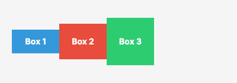
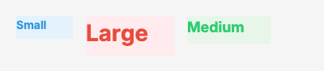

# align Property Visual Reference

The `align` property defines how flex items are aligned along the cross axis of a flex container. For `direction: row`, the cross axis is vertical. For `direction: column`, the cross axis is horizontal.

## Values

| Value | Description | Visual Example |
|-------|-------------|----------------|
| `stretch` | Items are stretched to fill the container's cross-axis. This is the default behavior. Items without an explicit cross-axis size will expand to fill available space. |  |
| `start` | Items are aligned at the start of the cross axis. Items maintain their intrinsic cross-axis size. |  |
| `center` | Items are centered along the cross axis, with equal space above and below (for row) or left and right (for column). |  |
| `end` | Items are aligned at the end of the cross axis. Items are positioned at the bottom (for row) or right (for column). |  |
| `baseline` | Items are aligned such that their text baselines line up. Particularly useful when items contain text of different sizes. |  |

## Code Examples

### YAML Template

```yaml
layout:
  - type: flex
    direction: row
    align: center
    children:
      - type: text
        content: "Centered Item"
```

### AST (C# Code)

```csharp
using FlexRender.Layout;
using FlexRender.Parsing.Ast;

var template = new Template
{
    Canvas = new CanvasSettings { Width = 400, Fixed = FixedDimension.Width },
    Elements = new List<TemplateElement>
    {
        new FlexElement
        {
            Direction = FlexDirection.Row,
            Align = AlignItems.Center,
            Children = new List<TemplateElement>
            {
                new TextElement { Content = "Centered Item" }
            }
        }
    }
};
```

## Notes

- The `align` property controls alignment along the **cross axis**, perpendicular to the main axis.
- For `direction: row`, align controls vertical alignment (top to bottom).
- For `direction: column`, align controls horizontal alignment (left to right).
- The `stretch` value only works when items do not have an explicit size on the cross axis.
- The `baseline` value is most effective when items contain text or other inline content.

## See Also

- [[Visual-Justify]] - Main axis alignment
- [[Flexbox-Layout]] - Complete flexbox layout reference
- [[Element-Reference]] - All available element types and properties
