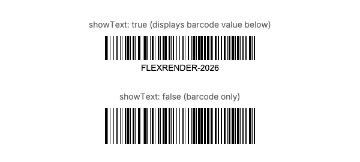
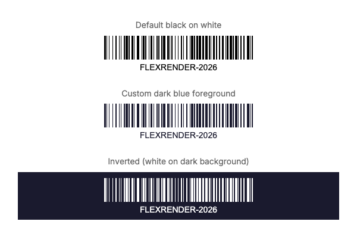

# Barcode Element - Visual Reference

The `barcode` element generates linear barcodes (Code 128) dynamically from text data.

## Properties

### Show Text Label

The `showText` property controls whether the human-readable barcode value is displayed below the barcode.

**Values:** `true`, `false`



**YAML Example:**
```yaml
- type: barcode
  data: "FLEXRENDER-2026"
  format: code128
  width: 250
  height: 60
  showText: true
```

**C# Example:**
```csharp
using FlexRender.Parsing.Ast;

var barcode = new BarcodeElement
{
    Data = "FLEXRENDER-2026",
    Format = BarcodeFormat.Code128,
    BarcodeWidth = 250,
    BarcodeHeight = 60,
    ShowText = true
};
```

**When to use:**
- **`showText: true`** - For retail, shipping labels, inventory where manual entry is a fallback
- **`showText: false`** - For compact designs, security badges, or when text is redundant

---

### Custom Colors

Barcodes support custom foreground and background colors.



**YAML Examples:**

**Default (black on white):**
```yaml
- type: barcode
  data: "FLEXRENDER-2026"
  format: code128
  width: 250
  height: 60
  showText: true
```

```csharp
using FlexRender.Parsing.Ast;

var barcode = new BarcodeElement
{
    Data = "FLEXRENDER-2026",
    Format = BarcodeFormat.Code128,
    BarcodeWidth = 250,
    BarcodeHeight = 60,
    ShowText = true
};
```

**Custom dark foreground:**
```yaml
- type: barcode
  data: "FLEXRENDER-2026"
  format: code128
  width: 250
  height: 60
  showText: true
  foreground: "#1a1a2e"
```

```csharp
using FlexRender.Parsing.Ast;

var barcode = new BarcodeElement
{
    Data = "FLEXRENDER-2026",
    Format = BarcodeFormat.Code128,
    BarcodeWidth = 250,
    BarcodeHeight = 60,
    ShowText = true,
    Foreground = "#1a1a2e"
};
```

**Inverted (white on dark background):**
```yaml
- type: barcode
  data: "FLEXRENDER-2026"
  format: code128
  width: 250
  height: 60
  showText: true
  foreground: "#ffffff"
  background: "#1a1a2e"
```

```csharp
using FlexRender.Parsing.Ast;

var barcode = new BarcodeElement
{
    Data = "FLEXRENDER-2026",
    Format = BarcodeFormat.Code128,
    BarcodeWidth = 250,
    BarcodeHeight = 60,
    ShowText = true,
    Foreground = "#ffffff"
    // Note: BarcodeElement doesn't have a Background property in the current implementation
};
```

---

## All Barcode Properties

| Property | Type | Description | Default |
|----------|------|-------------|---------|
| `data` | string | Text content to encode | (required) |
| `format` | enum | Barcode format (currently only `code128`) | `code128` |
| `width` | number | Barcode width in pixels | `200` |
| `height` | number | Barcode height in pixels | `50` |
| `showText` | boolean | Display human-readable text below barcode | `true` |
| `foreground` | color | Barcode line color | `#000000` |
| `background` | color | Barcode background color | `#ffffff` |

---

## Code 128 Format

Code 128 is a high-density linear barcode capable of encoding:
- All 128 ASCII characters
- Alphanumeric text
- Numbers
- Special characters

**Allowed characters:** A-Z, a-z, 0-9, and special characters like `-`, `_`, `/`, etc.

**Maximum length:** Practical limit is ~48 characters (longer barcodes become harder to scan)

---

## Scanning Considerations

1. **Contrast:** Ensure strong contrast between foreground and background (recommended ratio: 7:1 minimum)
2. **Width:** Minimum recommended width is 200px for reliable scanning
3. **Height:** Minimum recommended height is 40px
4. **Quiet zones:** The barcode element automatically includes required quiet zones (blank margins)
5. **Testing:** Always test barcodes with actual scanner hardware before production

---

## Common Use Cases

- **Product SKUs:** `SKU-12345-ABC`
- **Tracking numbers:** `TRACK-2026-001234`
- **Order IDs:** `ORDER-XYZ-789`
- **Asset tags:** `ASSET-LAPTOP-0042`
- **Serial numbers:** `SN-202601-001`

---

## See Also

- [QR Code Element](Visual-QR.md) - 2D QR codes
- [Text Element](Visual-Text.md) - Display text content
- [All Elements Overview](Elements.md)
