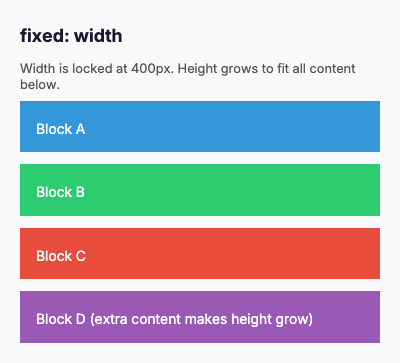
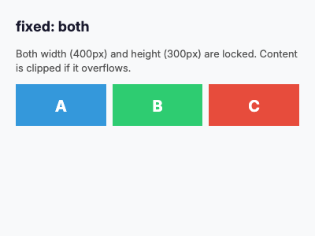
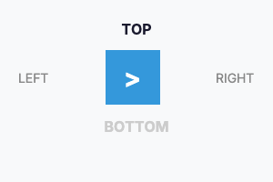
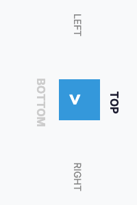
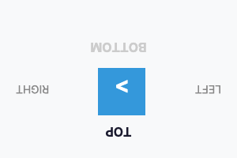
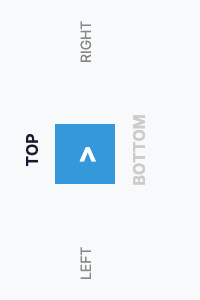

# Canvas Settings - Visual Reference

The `canvas` section in a template defines the rendering surface: its dimensions, sizing behavior, background color, and post-render rotation. These settings control the overall output image before any layout elements are placed.

## Properties

### fixed - Canvas Sizing Mode

The `fixed` property determines which canvas dimensions are locked to explicit values and which adjust automatically to fit content.

| Value | Description | Visual Example |
|-------|-------------|----------------|
| `width` | Width is fixed; height grows or shrinks to fit content. This is the **default**. |  |
| `height` | Height is fixed; width grows or shrinks to fit the widest content. |  |
| `both` | Both width and height are fixed. Content that overflows is clipped. |  |
| `none` | Neither dimension is fixed. Both width and height adjust to fit content exactly. |  |

**YAML Example:**
```yaml
canvas:
  fixed: width
  width: 400
  background: "#ffffff"
```

**C# Example:**
```csharp
using FlexRender.Parsing.Ast;

var template = new Template
{
    Canvas = new CanvasSettings
    {
        Fixed = FixedDimension.Width,
        Width = 400,
        Background = "#ffffff"
    }
};
```

---

### background - Canvas Background Color

The `background` property sets the base color of the canvas behind all rendered content. Accepts hex color strings.


**YAML Example:**
```yaml
canvas:
  fixed: width
  width: 400
  background: "#1a1a2e"
```

**C# Example:**
```csharp
using FlexRender.Parsing.Ast;

var template = new Template
{
    Canvas = new CanvasSettings
    {
        Fixed = FixedDimension.Width,
        Width = 400,
        Background = "#1a1a2e"
    }
};
```

---

### rotate - Canvas Rotation

The `rotate` property applies a post-render rotation to the entire canvas. The layout is computed in the original orientation, then the final image is rotated. For 90-degree and 270-degree rotations, the output image dimensions are swapped.

| Value | Degrees | Description | Visual Example |
|-------|---------|-------------|----------------|
| `none` | 0 | No rotation (default). |  |
| `right` | 90 | Rotate 90 degrees clockwise. Width and height are swapped in the output. |  |
| `flip` | 180 | Rotate 180 degrees. The image appears upside down. |  |
| `left` | 270 | Rotate 270 degrees clockwise (90 degrees counter-clockwise). Width and height are swapped. |  |

**YAML Example:**
```yaml
canvas:
  fixed: both
  width: 300
  height: 200
  rotate: right
```

**C# Example:**
```csharp
using FlexRender.Parsing.Ast;

var template = new Template
{
    Canvas = new CanvasSettings
    {
        Fixed = FixedDimension.Both,
        Width = 300,
        Height = 200,
        Rotate = "right"
    }
};
```

---

## All Canvas Properties

| Property | Type | Description | Default |
|----------|------|-------------|---------|
| `fixed` | enum | Sizing mode: `width`, `height`, `both`, `none` | `width` |
| `width` | integer | Canvas width in pixels | `300` |
| `height` | integer | Canvas height in pixels | `0` (auto) |
| `background` | color | Background color in hex format (e.g., `#ffffff`) | `#ffffff` |
| `rotate` | string | Post-render rotation: `none`, `left`, `right`, `flip`, or numeric degrees | `none` |

---

## Notes

- The `fixed` property defaults to `width`, which is the most common mode for document-like templates (receipts, reports, cards).
- When `fixed` is `none`, the canvas shrinks to the minimum size needed to contain all content. This is useful for badges, labels, or dynamically sized outputs.
- When `fixed` is `both`, content that exceeds the canvas dimensions may be clipped depending on the `overflow` setting of child flex containers.
- The `rotate` value is applied **after** the entire layout is rendered. All element sizes, positions, and text wrapping are computed in the pre-rotation coordinate system.
- For 90-degree and 270-degree rotations (`left` and `right`), the final output image swaps its width and height. A 300x200 canvas with `rotate: right` produces a 200x300 image.
- The `rotate` property also accepts arbitrary numeric degree values (e.g., `45`), though named values (`none`, `left`, `right`, `flip`) cover the most common use cases.
- For thermal printers, use `rotate: right` to convert a wide horizontal layout into a tall vertical image suitable for paper roll printing.

---

## See Also

- [[Visual-Direction]] - Flex container main axis direction
- [[Visual-Justify]] - Main axis alignment
- [[Visual-Align]] - Cross axis alignment
- [[Template-Syntax]] - Full template structure reference including canvas settings
- [[Element-Reference]] - All available element types and properties
