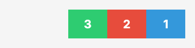
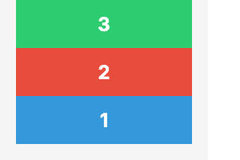

# direction Property Visual Reference

The `direction` property defines the main axis direction in which flex items are laid out within a flex container. It determines whether items flow horizontally or vertically, and in what order.

## Values

| Value | Description | Visual Example |
|-------|-------------|----------------|
| `row` | Items are laid out horizontally from left to right. This is the default behavior. The main axis runs horizontally. |  |
| `column` | Items are laid out vertically from top to bottom. The main axis runs vertically. |  |
| `row-reverse` | Items are laid out horizontally from right to left. The main axis runs horizontally in reverse. |  |
| `column-reverse` | Items are laid out vertically from bottom to top. The main axis runs vertically in reverse. |  |

## Code Examples

### YAML Template

```yaml
layout:
  - type: flex
    direction: column
    children:
      - type: text
        content: "First Item"
      - type: text
        content: "Second Item"
      - type: text
        content: "Third Item"
```

### AST (C# Code)

```csharp
using FlexRender.Layout;
using FlexRender.Parsing.Ast;

var template = new Template
{
    Canvas = new CanvasSettings { Width = 400, Fixed = FixedDimension.Width },
    Elements = new List<TemplateElement>
    {
        new FlexElement
        {
            Direction = FlexDirection.Column,
            Children = new List<TemplateElement>
            {
                new TextElement { Content = "First Item" },
                new TextElement { Content = "Second Item" },
                new TextElement { Content = "Third Item" }
            }
        }
    }
};
```

## Notes

- The `direction` property determines the **main axis** of the flex container.
- `justify` aligns items along the main axis (the direction set by this property).
- `align` aligns items along the cross axis (perpendicular to the direction).
- For `row` and `row-reverse`, the main axis is horizontal.
- For `column` and `column-reverse`, the main axis is vertical.
- The `-reverse` variants reverse the order of items but do not change which axis is the main axis.

## See Also

- [[Visual-Justify]] - Main axis alignment
- [[Visual-Align]] - Cross axis alignment
- [[Visual-Wrap]] - Multi-line wrapping behavior
- [[Flexbox-Layout]] - Complete flexbox layout reference
- [[Element-Reference]] - All available element types and properties
