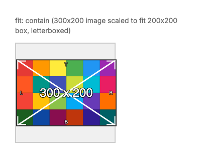
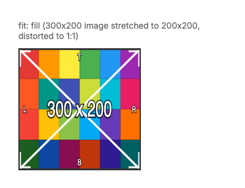
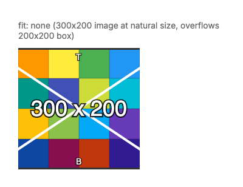

# Image Element - Visual Reference

The `image` element displays images from HTTP URLs or local file paths.

## Properties

### Image Fit Modes

The `fit` property controls how images are sized and positioned within their container.

#### Contain

Scales the image to fit inside the container while maintaining aspect ratio. The entire image is visible, and letterboxing may occur.



**YAML Example:**
```yaml
- type: image
  src: "https://placehold.co/200x100/4A90D9/ffffff.png"
  fit: contain
```

**C# Example:**
```csharp
using FlexRender.Parsing.Ast;

var image = new ImageElement
{
    Src = "https://placehold.co/200x100/4A90D9/ffffff.png",
    Fit = ImageFit.Contain
};
```

---

#### Cover

Scales the image to fill the entire container while maintaining aspect ratio. The image may be cropped to fit.


**YAML Example:**
```yaml
- type: image
  src: "https://placehold.co/200x100/4A90D9/ffffff.png"
  fit: cover
```

**C# Example:**
```csharp
using FlexRender.Parsing.Ast;

var image = new ImageElement
{
    Src = "https://placehold.co/200x100/4A90D9/ffffff.png",
    Fit = ImageFit.Cover
};
```

---

#### Fill

Stretches the image to fill the container exactly. Aspect ratio is NOT maintained and the image may appear distorted.



**YAML Example:**
```yaml
- type: image
  src: "https://placehold.co/200x100/4A90D9/ffffff.png"
  fit: fill
```

**C# Example:**
```csharp
using FlexRender.Parsing.Ast;

var image = new ImageElement
{
    Src = "https://placehold.co/200x100/4A90D9/ffffff.png",
    Fit = ImageFit.Fill
};
```

---

#### None

Displays the image at its natural size without any scaling. The image may overflow the container.



**YAML Example:**
```yaml
- type: image
  src: "https://placehold.co/200x100/4A90D9/ffffff.png"
  fit: none
```

**C# Example:**
```csharp
using FlexRender.Parsing.Ast;

var image = new ImageElement
{
    Src = "https://placehold.co/200x100/4A90D9/ffffff.png",
    Fit = ImageFit.None
};
```

---

## All Image Properties

| Property | Type | Description | Default |
|----------|------|-------------|---------|
| `src` | string | Image URL (HTTP/HTTPS) or local file path | (required) |
| `fit` | enum | Fit mode: `contain`, `cover`, `fill`, `none` | `contain` |
| `width` | length | Container width | (auto) |
| `height` | length | Container height | (auto) |

---

## Image Source Support

- **HTTP/HTTPS URLs:** Fully supported, images are cached automatically
- **Local files:** Relative paths from template directory
- **Supported formats:** PNG, JPG, JPEG, BMP, GIF, WEBP

---

## Usage Tips

1. **`contain`** - Best for logos, icons, and images where you need to see the entire image
2. **`cover`** - Best for backgrounds, hero images, and full-bleed photos
3. **`fill`** - Use sparingly, only when distortion is acceptable
4. **`none`** - Useful for pixel-perfect rendering at original size

---

## See Also

- [QR Code Element](Visual-QR.md) - Generated QR codes
- [Barcode Element](Visual-Barcode.md) - Generated barcodes
- [All Elements Overview](Elements.md)
