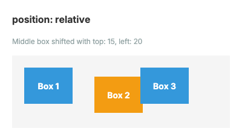
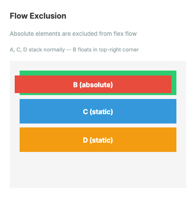
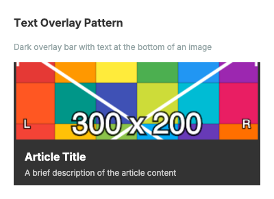
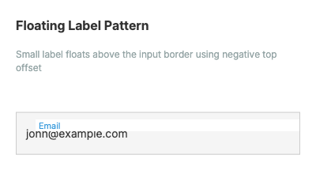

# position Property Visual Reference

The `position` property controls how an element is positioned within its container. FlexRender supports three positioning modes matching CSS behavior: `static` (default), `relative`, and `absolute`.

## Position Modes

### static (default)
Element follows normal flex flow. No offset properties are applied.

### relative
Element is offset from its normal flow position. Siblings are not affected.

| Example | Description | Visual |
|---------|-------------|--------|
| Offset | Middle box shifted with `top: 15, left: 20` from normal position |  |

### absolute
Element is removed from flex flow and positioned relative to its containing flex parent's padding box.

| Example | Description | Visual |
|---------|-------------|--------|
| Top/Left | Box pinned to `top: 10, left: 10` |  |
| Bottom/Right | Box pinned to `bottom: 10, right: 10` |  |
| Centered | Box centered via equal insets on all sides |  |
| Flow Exclusion | Absolute elements excluded from flex flow — A, C, D stack normally |  |
| Inset Sizing | Width/height computed from opposing insets (no explicit size) |  |

## Practical Patterns

| Pattern | Description | Visual |
|---------|-------------|--------|
| Badge | Star badge overlaid on product card with `top: 8, right: 8` |  |
| Text Overlay | Dark bar with text at bottom of image using `bottom: 0, left: 0, right: 0` |  |
| Floating Label | Input label floats above border with `top: -8, left: 12` |  |

## Code Examples

### YAML Template

```yaml
# Badge pattern — star overlay on card
- type: flex
    overflow: hidden
    children:
      - type: image
        src: "product.png"
        fit: cover
      - type: image
        position: absolute
        top: "8"
        right: "8"
        src: "star-badge.png"
        width: "24"
        height: "24"
```

### AST (C# Code)

```csharp
using FlexRender.Layout;
using FlexRender.Parsing.Ast;

var container = new FlexElement
{
    Width = "300", Height = "200",
    Overflow = Overflow.Hidden
};

// Absolute badge in top-right corner
container.AddChild(new FlexElement
{
    Position = Position.Absolute,
    Top = "8", Right = "8",
    Width = "24", Height = "24",
    Background = "#e74c3c"
});
```

## Inset Properties

| Property | Type | Description |
|----------|------|-------------|
| `top` | string | Offset from top edge of containing block's padding box |
| `right` | string | Offset from right edge |
| `bottom` | string | Offset from bottom edge |
| `left` | string | Offset from left edge |

**Priority rules:**
- `left` takes priority over `right` when both are specified (for `position: relative`)
- `top` takes priority over `bottom` when both are specified (for `position: relative`)
- For `position: absolute`, opposing insets (`left` + `right` or `top` + `bottom`) without explicit size compute the element's width/height (inset sizing)

## Notes

- Absolute elements are excluded from flex flow — siblings layout as if the absolute element doesn't exist
- Absolute elements are excluded from intrinsic measurement — parent sizing ignores them
- Relative positioning does not affect sibling positions — space is reserved at the original position
- When no insets are specified on an absolute element, it defaults to `justify-content` (main axis) and `align-items` (cross axis) fallback positioning
- Inset values support pixels, percentages, and em units
- Use `overflow: hidden` on the parent to clip overflowing absolute elements

## See Also

- [[Flexbox-Layout]] - Complete flexbox layout reference
- [[Element-Reference]] - All element types and properties
- [[Visual-Reference]] - Index of all visual documentation pages
