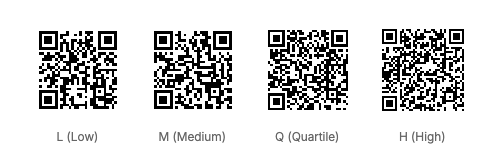
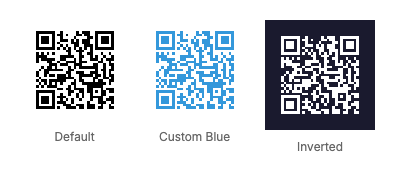

# QR Code Element - Visual Reference

The `qr` element generates QR codes dynamically from text data.

## Properties

### Error Correction Levels

The `errorCorrection` property controls the amount of redundancy in the QR code, allowing it to remain readable even if partially damaged.

**Values:** `L` (Low ~7%), `M` (Medium ~15%), `Q` (Quartile ~25%), `H` (High ~30%)



**YAML Example:**
```yaml
- type: qr
  data: "https://github.com/RoboNET/FlexRender"
  size: 100
  errorCorrection: H
```

**C# Example:**
```csharp
using FlexRender.Parsing.Ast;

var qrCode = new QrElement
{
    Data = "https://github.com/RoboNET/FlexRender",
    Size = 100,
    ErrorCorrection = ErrorCorrectionLevel.H
};
```

**Trade-offs:**
- **Higher error correction** = More damage tolerance, but denser/more complex QR code
- **Lower error correction** = Simpler QR code, faster scanning, but less damage tolerance

**Recommended:**
- Use `L` or `M` for digital displays (no physical damage)
- Use `Q` or `H` for printed materials (may get damaged/dirty)

---

### Custom Colors

QR codes support custom foreground and background colors.



**YAML Examples:**

**Default (black on white):**
```yaml
- type: qr
  data: "https://github.com/RoboNET/FlexRender"
  size: 100
  errorCorrection: M
```

```csharp
using FlexRender.Parsing.Ast;

var qrCode = new QrElement
{
    Data = "https://github.com/RoboNET/FlexRender",
    Size = 100,
    ErrorCorrection = ErrorCorrectionLevel.M
};
```

**Custom foreground color:**
```yaml
- type: qr
  data: "https://github.com/RoboNET/FlexRender"
  size: 100
  errorCorrection: M
  foreground: "#3498db"
```

```csharp
using FlexRender.Parsing.Ast;

var qrCode = new QrElement
{
    Data = "https://github.com/RoboNET/FlexRender",
    Size = 100,
    ErrorCorrection = ErrorCorrectionLevel.M,
    Foreground = "#3498db"
};
```

**Inverted (white on dark background):**
```yaml
- type: qr
  data: "https://github.com/RoboNET/FlexRender"
  size: 100
  errorCorrection: M
  foreground: "#ffffff"
  background: "#1a1a2e"
```

```csharp
using FlexRender.Parsing.Ast;

var qrCode = new QrElement
{
    Data = "https://github.com/RoboNET/FlexRender",
    Size = 100,
    ErrorCorrection = ErrorCorrectionLevel.M,
    Foreground = "#ffffff"
    // Note: QrElement doesn't have a Background property in the current implementation
};
```

---

## All QR Code Properties

| Property | Type | Description | Default |
|----------|------|-------------|---------|
| `data` | string | Text content to encode | (required) |
| `size` | number | QR code size in pixels | `100` |
| `errorCorrection` | enum | Error correction: `L`, `M`, `Q`, `H` | `M` |
| `foreground` | color | QR code foreground color | `#000000` |
| `background` | color | QR code background color | `#ffffff` |

---

## Data Encoding

QR codes can encode:
- URLs (https://example.com)
- Plain text
- Email addresses (mailto:user@example.com)
- Phone numbers (tel:+1234567890)
- vCard contact info
- WiFi credentials
- Any UTF-8 text (up to ~4,296 alphanumeric characters)

**Note:** Longer data creates more complex QR codes. Keep data concise for better scannability.

---

## Scanning Considerations

1. **Contrast:** Ensure good contrast between foreground and background colors
2. **Size:** Minimum recommended size is 100px for reliable scanning
3. **Error correction:** Use higher levels if QR code might be damaged or obscured
4. **Testing:** Always test QR codes with actual scanner apps before production

---

## See Also

- [Barcode Element](Visual-Barcode.md) - Linear barcodes
- [Image Element](Visual-Image.md) - Display external images
- [All Elements Overview](Elements.md)
