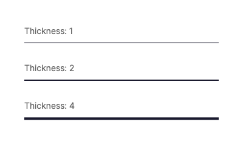

# Separator Element - Visual Reference

The `separator` element creates horizontal or vertical dividing lines between content sections.

## Properties

### Separator Styles

The `style` property controls the visual appearance of the line.

**Values:** `solid`, `dashed`, `dotted`


**YAML Example:**
```yaml
- type: separator
  style: dashed
  thickness: 2
  color: "#1a1a2e"
```

**C# Example:**
```csharp
using FlexRender.Parsing.Ast;

var separator = new SeparatorElement
{
    Style = SeparatorStyle.Dashed,
    Thickness = 2,
    Color = "#1a1a2e"
};
```

---

### Orientation

The `orientation` property controls whether the separator is horizontal or vertical.

**Values:** `horizontal`, `vertical`


**YAML Example:**
```yaml
- type: separator
  orientation: vertical
  style: solid
  thickness: 2
  color: "#3498db"
```

**C# Example:**
```csharp
using FlexRender.Parsing.Ast;

var separator = new SeparatorElement
{
    Orientation = SeparatorOrientation.Vertical,
    Style = SeparatorStyle.Solid,
    Thickness = 2,
    Color = "#3498db"
};
```

**Note:** Vertical separators work best inside flex containers with `direction: row` and `align: stretch`.

---

### Thickness

The `thickness` property controls the width of the separator line.

**Values:** Any positive number (in pixels)



**YAML Example:**
```yaml
- type: separator
  style: solid
  thickness: 4
  color: "#1a1a2e"
```

**C# Example:**
```csharp
using FlexRender.Parsing.Ast;

var separator = new SeparatorElement
{
    Style = SeparatorStyle.Solid,
    Thickness = 4,
    Color = "#1a1a2e"
};
```

---

## All Separator Properties

| Property | Type | Description | Default |
|----------|------|-------------|---------|
| `style` | enum | Line style: `solid`, `dashed`, `dotted` | `solid` |
| `orientation` | enum | Direction: `horizontal`, `vertical` | `horizontal` |
| `thickness` | number | Line thickness in pixels | `1` |
| `color` | color | Line color | `#000000` |
| `height` | length | Fixed height (for vertical separators) | (auto) |

---

## Usage Tips

1. **Horizontal separators** automatically span the full width of their container
2. **Vertical separators** need explicit height or should be in a stretched flex container
3. Use `gap` on the parent flex container instead of separators when you just need spacing
4. Separators are great for visual hierarchy in lists, sections, and navigation

---

## See Also

- [Flex Layout](Visual-Flex.md) - Layout container for separators
- [Text Element](Visual-Text.md) - Text content
- [All Elements Overview](Elements.md)
