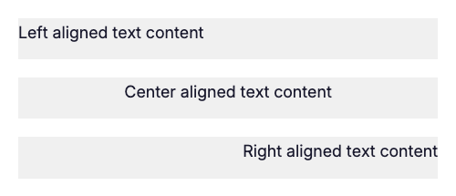
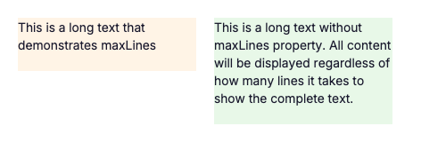
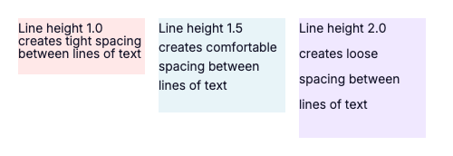

# Text Element - Visual Reference

The `text` element is used to display styled text content in your templates.

## Properties

### Text Alignment

The `align` property controls horizontal text alignment within its container.

**Values:** `left`, `center`, `right`



**YAML Example:**
```yaml
- type: text
  content: "Center aligned text content"
  align: center
  size: 18px
  color: "#1a1a2e"
```

**C# Example:**
```csharp
using FlexRender.Parsing.Ast;

var textElement = new TextElement
{
    Content = "Center aligned text content",
    Align = TextAlign.Center,
    Size = "18px",
    Color = "#1a1a2e"
};
```

---

### Text Wrapping

The `wrap` property controls whether text wraps to multiple lines or overflows.

**Values:** `true`, `false`


**YAML Example:**
```yaml
- type: text
  content: "This is a very long text that will wrap across multiple lines..."
  wrap: true
  size: 14px
```

**C# Example:**
```csharp
using FlexRender.Parsing.Ast;

var textElement = new TextElement
{
    Content = "This is a very long text that will wrap across multiple lines...",
    Wrap = true,
    Size = "14px"
};
```

---

### Max Lines & Overflow

The `maxLines` property limits text to a specific number of lines. Use with `overflow: ellipsis` to show truncation.

**Values:** Any positive integer



**YAML Example:**
```yaml
- type: text
  content: "This is a long text that demonstrates maxLines property..."
  wrap: true
  maxLines: 2
  overflow: ellipsis
  size: 14px
```

**C# Example:**
```csharp
using FlexRender.Parsing.Ast;

var textElement = new TextElement
{
    Content = "This is a long text that demonstrates maxLines property...",
    Wrap = true,
    MaxLines = 2,
    Overflow = TextOverflow.Ellipsis,
    Size = "14px"
};
```

---

### Line Height

The `lineHeight` property controls vertical spacing between lines of text.

**Values:** Decimal numbers (e.g., `1.0`, `1.5`, `2.0`)



**YAML Example:**
```yaml
- type: text
  content: "Line height 1.5 creates comfortable spacing between lines"
  wrap: true
  lineHeight: "1.5"
  size: 14px
```

**C# Example:**
```csharp
using FlexRender.Parsing.Ast;

var textElement = new TextElement
{
    Content = "Line height 1.5 creates comfortable spacing between lines",
    Wrap = true,
    LineHeight = "1.5",
    Size = "14px"
};
```

---

## All Text Properties

| Property | Type | Description | Default |
|----------|------|-------------|---------|
| `content` | string | Text to display | (required) |
| `align` | enum | Horizontal alignment: `left`, `center`, `right` | `left` |
| `size` | length | Font size (e.g., `14px`, `1em`) | `14px` |
| `color` | color | Text color | `#000000` |
| `font` | string | Font variant (e.g., `default`, `bold`, `semibold`) | `default` |
| `wrap` | boolean | Enable text wrapping | `false` |
| `maxLines` | integer | Maximum number of lines | (unlimited) |
| `overflow` | enum | Overflow behavior: `clip`, `ellipsis` | `clip` |
| `lineHeight` | number | Line height multiplier | `1.0` |
| `background` | color | Background color | (transparent) |
| `padding` | length | Internal spacing | `0` |

---

## See Also

- [Flex Layout](Visual-Flex.md) - Layout container for text elements
- [Separator Element](Visual-Separator.md) - Visual dividers
- [All Elements Overview](Elements.md)
