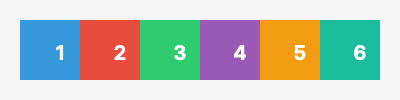
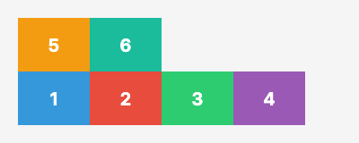

# wrap Property Visual Reference

The `wrap` property controls whether flex items are forced onto a single line or can wrap onto multiple lines within a flex container. It determines how items behave when they exceed the container's main axis size.

## Values

| Value | Description | Visual Example |
|-------|-------------|----------------|
| `nowrap` | All items are laid out on a single line, even if they overflow the container. This is the default behavior. Items may shrink to fit. |  |
| `wrap` | Items wrap onto multiple lines from top to bottom (for `row`) or left to right (for `column`). New lines are added in the natural direction. |  |
| `wrap-reverse` | Items wrap onto multiple lines from bottom to top (for `row`) or right to left (for `column`). New lines are added in reverse order. |  |

## Code Examples

### YAML Template

```yaml
layout:
  - type: flex
    direction: row
    wrap: wrap
    width: "360"
    children:
      - type: flex
        width: "80"
        # More items...
```

### AST (C# Code)

```csharp
using FlexRender.Layout;
using FlexRender.Parsing.Ast;

var template = new Template
{
    Canvas = new CanvasSettings { Width = 400, Fixed = FixedDimension.Width },
    Elements = new List<TemplateElement>
    {
        new FlexElement
        {
            Direction = FlexDirection.Row,
            Wrap = FlexWrap.Wrap,
            Width = "360",
            Children = new List<TemplateElement>
            {
                new FlexElement { Width = "80" }
                // More items...
            }
        }
    }
};
```

## Notes

- The `wrap` property only takes effect when items would overflow the container's main axis.
- With `nowrap`, items may shrink below their preferred size to fit on one line.
- With `wrap` or `wrap-reverse`, items maintain their preferred size and create new lines as needed.
- The `-reverse` variant changes the direction in which new lines are stacked, not the order of items within a line.
- For `direction: row`, wrapping creates new horizontal lines stacked vertically.
- For `direction: column`, wrapping creates new vertical columns arranged horizontally.

## See Also

- [[Visual-Direction]] - Main axis direction
- [[Visual-Justify]] - Main axis alignment
- [[Visual-Align]] - Cross axis alignment
- [[Flexbox-Layout]] - Complete flexbox layout reference
- [[Element-Reference]] - All available element types and properties
